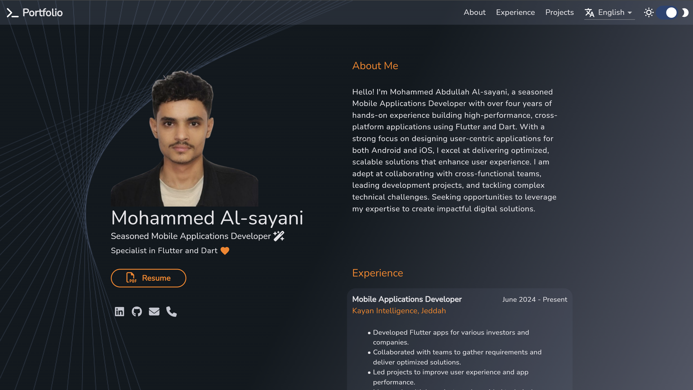

My personal Portfolio
==============

Flutter [Portfolio](https://m-alsayani/) – by [@MohammedAlsayani](https://github.com/MohammedAlsayani)

## Features

- Responsive and adaptive design, inspired by [Brittany Chiang](https://brittanychiang.com)
- Implements the [Riverpod Architecture](https://codewithandrea.com/articles/flutter-app-architecture-riverpod-introduction/) by [Andrea Bizzotto](https://github.com/bizz84)
- Implements a feature-first structure
- Supports multi languages
- Supports multi themes

## License

See the [LICENSE](https://github.com/EugenioTesio/portfolio/blob/main/LICENSE.md) file.

